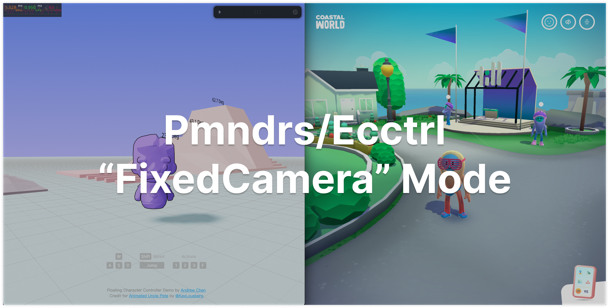

## New Features

### (2024-6-24) FixedCamera Mode:

- The “FixedCamera” mode automatically rotates the camera as the character turns (similar to the controls in Coastal World). You can activate it with the following code:

`<Ecctrl mode="FixedCamera">`

[]

### (2024-1-1) EcctrlMode:

- Now you can seamlessly switch between different modes by adding "mode" inside Ecctrl.

`<Ecctrl mode="PointToMove">`

- "PointToMove" mode is designed for click-to-move or path following features. (no needs for keyboard controls)

```js
import { useGame } from 'ecctrl'
// ...
const setMoveToPoint = useGame((state) => state.setMoveToPoint)
// ...
// call function setMoveToPoint(), whenever character needs to move
setMoveToPoint(point) // "point" is a vec3 value 
```

- Here is a simple click-to-move example: [Ecctrl CodeSandbox](https://codesandbox.io/p/sandbox/ecctrl-pointtomove-m9z6xh)

[](https://codesandbox.io/p/sandbox/ecctrl-pointtomove-m9z6xh)

### (2023-11-18) EcctrlJoystick:

- Ecctrl now supports touch screen control!

- You can easily import and use the built-in 3D joystick.
  (note: place EcctrlJoystick outside of the canvas component)

```js
import Ecctrl, {EcctrlJoystick} from 'ecctrl'
//...
  <EcctrlJoystick />
  <Canvas>
    {/* ... */}
  </Canvas>
//...
```

- For more detailed settings, including lights, materials, and textures, please refer to the following sections.

- Additionally, I've prepared a simple [Ecctrl CodeSandbox](https://codesandbox.io/s/ecctrl-w-o-animations-3k3zxt) for online testing and demostration.

- Also, here is another [Ecctrl CodeSandbox](https://codesandbox.io/s/ecctrl-with-animations-nr4493) showcasing character animation functionality.

[](https://codesandbox.io/s/ecctrl-w-o-animations-3k3zxt)

### (2023-10-02) Pmndrs/ecctrl & npm package:

- The character controller now integrated with [pmndrs/ecctrl](https://github.com/pmndrs/ecctrl)

- You can easily install the npm package using the following command:

```bash
npm install ecctrl
```

To get started, import `Ecctrl` and `EcctrlAnimation`, then wrap your character model within `<Ecctrl>`:

```js
import Ecctrl, {EcctrlAnimation} from 'ecctrl'
...
  <Ecctrl>
    <CharacterModel/>
  </Ecctrl>
...
```

- Additionally, I've prepared a simple [Ecctrl CodeSandbox](https://codesandbox.io/s/ecctrl-w-o-animations-3k3zxt) for online testing and demostration.

- Also, here is another [Ecctrl CodeSandbox](https://codesandbox.io/s/ecctrl-with-animations-nr4493) showcasing character animation functionality.
 
[](https://codesandbox.io/s/ecctrl-w-o-animations-3k3zxt)

### (2023-09-13) New Character & Physics Enhancements:

- Incorporate 11 dynamic animations with new floating character, Uncle Pete
- Implement action and reaction forces on frictionless floating platforms:
  - Platforms now move opposite to the character's moving direction (Having less impact on havier platforms)
  - Character also applies drag force (friction) to the standing platform
  - Character's free fall height now impacts on platform reaction forces
  - Add extra downward force upon character jumps for more realistic physics
  
  [](https://github.com/erdongchen-andrew/CharacterControl/tree/main/example)

### (2023-08-28) Character Animations:

- Incorporate 8 built-in dynamic animations (including 3 for jump actions)
- Flexibility to add and personalize additional animations
- Fine-tune slope angle's impact on jump direction (fully customizable)
- Tailor the rejection velocity for sudden changes in movement direction (fully customizable)

  [](https://github.com/erdongchen-andrew/CharacterControl/tree/main/example)

### (2023-08-10) Camera Enhancement:

- Collision detection
- Zoom in/out capability
- Expanded movement range
- Improved tracking smoothness

### (2023-07-27) Character Auto Balance:

- Character tilts forward/backward while in motion
- Automatically returns to upright position after a hit or attack
- Stability customization: Users can fine-tune the balance sensitivity to match their gameplay style