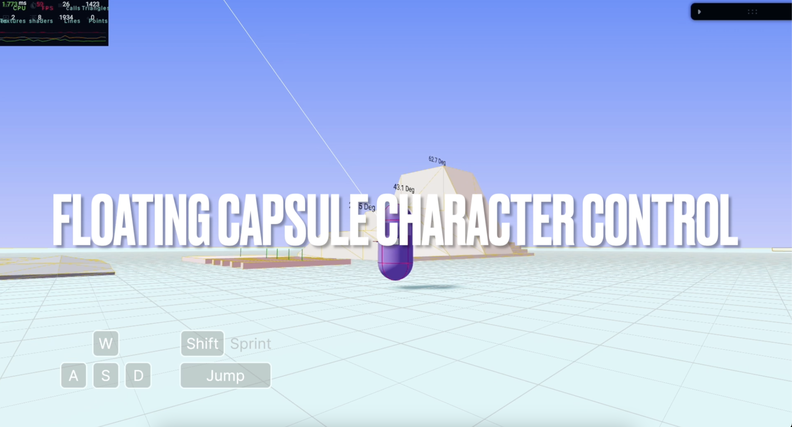
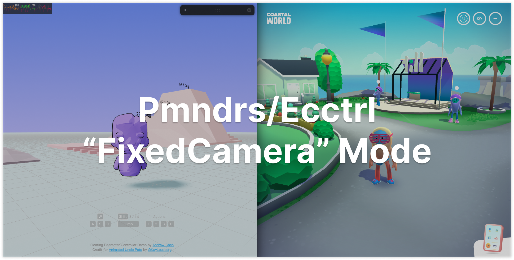

# Ecctrl Floating Capsule Character Controller

[](https://character-control.vercel.app/)

[Pmndrs/ecctrl](https://github.com/pmndrs/ecctrl) is a simple web based character controller build on [react-three-fiber](https://github.com/pmndrs/react-three-fiber) and [react-three-rapier](https://github.com/pmndrs/react-three-rapier). It provides a playground demo where you can experience the following features:

1. Seamless movement over small obstacles
2. Enhanced control with floating force incorporating spring and damping forces
3. Rigidbody character functionality for interaction with the game environment
4. Customizable ground friction for tailored control
5. Realistic simulation with applied mass on supporting surfaces
6. Smooth integration with moving and rotating platforms

## New Features

### (2024-6-24) FixedCamera Mode:

- The “FixedCamera” mode automatically rotates the camera as the character turns (similar to the controls in Coastal World). You can activate it with the following code:

`<Ecctrl mode="FixedCamera">`



Check out the [featurelog.md](/featurelog.md) for details on previous updates and features.

## Project Link

Live Demo: [Floating Capsule Character Controller](https://character-control.vercel.app/)

## Local Setup

Download [Node.js](https://nodejs.org/en/download). Run this followed commands:

```bash
# Install dependencies (only the first time)
npm install

# Run the local server at localhost:5173
npm run dev

# Build for production in the example/exampleDist/ directory
vite build -c vercelVite.config.js
```

## How To Use

### Basic Controls ([CodeSandbox Demo](https://codesandbox.io/s/ecctrl-w-o-animations-3k3zxt))

```bash
npm install ecctrl
```

```js
import Ecctrl, { EcctrlAnimation } from "ecctrl";
```

To get started, set up your keyboard map using [KeyboardControls](https://github.com/pmndrs/drei#keyboardcontrols). Then, wrap your character model within `<Ecctrl>`:

```js
/**
 * Keyboard control preset
 */
const keyboardMap = [
  { name: "forward", keys: ["ArrowUp", "KeyW"] },
  { name: "backward", keys: ["ArrowDown", "KeyS"] },
  { name: "leftward", keys: ["ArrowLeft", "KeyA"] },
  { name: "rightward", keys: ["ArrowRight", "KeyD"] },
  { name: "jump", keys: ["Space"] },
  { name: "run", keys: ["Shift"] },
  // Optional animation key map
  { name: "action1", keys: ["1"] },
  { name: "action2", keys: ["2"] },
  { name: "action3", keys: ["3"] },
  { name: "action4", keys: ["KeyF"] },
];

return (
  <>
    ...
    <Physics debug={physics} timeStep="vary">
      {/* Keyboard preset */}
      <KeyboardControls map={keyboardMap}>
        {/* Character Control */}
        <Ecctrl>
          {/* Replace your model here */}
          <CharacterModel />
        </Ecctrl>
      </KeyboardControls>
      ...
    </Physics>
  </>
);
```

Here are all the default properties you can play with for `<Ecctrl>`:

```js
// Default properties for Ecctrl
EcctrlProps: {
  children, // ReactNode
  debug: false, // Enable debug mode (require leva package)
  capsuleHalfHeight: 0.35, // Half-height of the character capsule
  capsuleRadius: 0.3, // Radius of the character capsule
  floatHeight: 0.3, // Height of the character when floating
  characterInitDir: 0, // Character initial facing direction (in rad)
  followLight: false, // Enable follow light mode (name your light "followLight" before turn this on)
  disableControl: false, // Disable the ecctrl control feature
  disableFollowCam: false, // Disable follow camera feature
  disableFollowCamPos: { x: 0, y: 0, z: -5 }, // Camera position when the follow camera feature is disabled
  disableFollowCamTarget: { x: 0, y: 0, z: 0 }, // Camera lookAt target when the follow camera feature is disabled
  // Follow camera setups
  camInitDis: -5, // Initial camera distance
  camMaxDis: -7, // Maximum camera distance
  camMinDis: -0.7, // Minimum camera distance
  camUpLimit: 1.5, // Camera upward limit (in rad)
  camLowLimit: -1.3, // Camera loward limit (in rad)
  camInitDir: { x: 0, y: 0 }, // Camera initial rotation direction (in rad)
  camTargetPos: { x: 0, y: 0, z: 0 }, // Camera target position
  camMoveSpeed: 1, // Camera moving speed multiplier
  camZoomSpeed: 1, // Camera zooming speed multiplier
  camCollision: true, // Camera collision active/deactive
  camCollisionOffset: 0.7, // Camera collision offset
  camCollisionSpeedMult: 4, // Camera collision lerping speed multiplier
  fixedCamRotMult: 1, // Camera rotate speed multiplier (FixedCamera mode)
  camListenerTarget: "domElement", // Camera listener target ("domElement" | "document")
  // Follow light setups
  followLightPos: { x: 20, y: 30, z: 10 }, // Follow light position
  // Base control setups
  maxVelLimit: 2.5, // Maximum velocity limit
  turnVelMultiplier: 0.2, // Turn velocity multiplier
  turnSpeed: 15, // Turn speed
  sprintMult: 2, // Sprint speed multiplier
  jumpVel: 4, // Jump velocity
  jumpForceToGroundMult: 5, // Jump force to ground object multiplier
  slopJumpMult: 0.25, // Slope jump affect multiplier
  sprintJumpMult: 1.2, // Sprint jump multiplier
  airDragMultiplier: 0.2, // Air drag multiplier
  dragDampingC: 0.15, // Drag damping coefficient
  accDeltaTime: 8, // Acceleration delta time
  rejectVelMult: 4, // Reject velocity multiplier
  moveImpulsePointY: 0.5, // Move impulse point Y offset
  camFollowMult: 11, // Camera follow target speed multiplier
  camLerpMult: 25, // Camera lerp to position speed multiplier
  fallingGravityScale: 2.5, // Character is falling, apply higher gravity
  fallingMaxVel: -20, // Limit character max falling velocity
  wakeUpDelay: 200, // Wake up character delay time after window visibility change to visible (in ms)
  // Floating Ray setups
  rayOriginOffest: { x: 0, y: -capsuleHalfHeight, z: 0 }, // Ray origin offset
  rayHitForgiveness: 0.1, // Ray hit forgiveness
  rayLength: capsuleRadius + 2, // Ray length
  rayDir: { x: 0, y: -1, z: 0 }, // Ray direction
  floatingDis: capsuleRadius + floatHeight, // Floating distance
  springK: 1.2, // Spring constant
  dampingC: 0.08, // Damping coefficient
  // Slope Ray setups
  showSlopeRayOrigin: false, // Show slope ray origin
  slopeMaxAngle: 1, // in rad, the max walkable slope angle
  slopeRayOriginOffest: capsuleRadius - 0.03, // Slope ray origin offset
  slopeRayLength: capsuleRadius + 3, // Slope ray length
  slopeRayDir: { x: 0, y: -1, z: 0 }, // Slope ray direction
  slopeUpExtraForce: 0.1, // Slope up extra force
  slopeDownExtraForce: 0.2, // Slope down extra force
  // AutoBalance Force setups
  autoBalance: true, // Enable auto-balance
  autoBalanceSpringK: 0.3, // Auto-balance spring constant
  autoBalanceDampingC: 0.03, // Auto-balance damping coefficient
  autoBalanceSpringOnY: 0.5, // Auto-balance spring on Y-axis
  autoBalanceDampingOnY: 0.015, // Auto-balance damping on Y-axis
  // Animation temporary setups
  animated: false, // Enable animation
  // Mode setups
  mode: null, // Activate different ecctrl modes ("CameraBasedMovement" | "FixedCamera" | "PointToMove")
  // Customizable controller key setups
  controllerKeys: { forward: 12, backward: 13, leftward: 14, rightward: 15, jump: 2, action1: 11, action2: 3, action3: 1, action4: 0 },
  // Point-to-move setups
  bodySensorSize: [capsuleHalfHeight / 2, capsuleRadius], // cylinder body sensor [halfHeight, radius]
  bodySensorPosition: { x: 0, y: 0, z: capsuleRadius / 2 },
  // Other rigibody props from parent
  // Rigidbody props can be used here,
  // such as position, friction, gravityScale, etc.
  ...props
}

// Simply change the value by doing this
<Ecctrl maxVelLimit={5} jumpVel={4} position={[0,10,0]}>
  <CharacterModel />
</Ecctrl>
```

### Apply Character Animations ([CodeSandbox Demo](https://codesandbox.io/s/ecctrl-with-animations-nr4493))

If you want to apply character animations, prepare the character url and customize the `animationSet` with your own animation names. Change the `Ecctrl` property `animated` to true and wrap your character model inside `<EcctrlAnimation>` tag:

```js
// Prepare character model url
const characterURL = "./ReplaceWithYourCharacterURL";

// Prepare and rename your character animations here
// Note: idle, walk, run, jump, jumpIdle, jumpLand and fall names are essential
// Missing any of these names might result in an error: "cannot read properties of undifined (reading 'reset')"
const animationSet = {
  idle: "Idle",
  walk: "Walk",
  run: "Run",
  jump: "Jump_Start",
  jumpIdle: "Jump_Idle",
  jumpLand: "Jump_Land",
  fall: "Climbing", // This is for falling from high sky
  // Currently support four additional animations
  action1: "Wave",
  action2: "Dance",
  action3: "Cheer",
  action4: "Attack(1h)", // This is special action which can be trigger while walking or running
};

return (
  <>
    ...
    <Physics debug={physics} timeStep="vary">
      {/* Keyboard preset */}
      <KeyboardControls map={keyboardMap}>
        {/* Character Control */}
        <Ecctrl animated>
          {/* Character Animations */}
          <EcctrlAnimation
            characterURL={characterURL} // Must have property
            animationSet={animationSet} // Must have property
          >
            {/* Replace your model here */}
            <CharacterModel />
          </EcctrlAnimation>
        </Ecctrl>
      </KeyboardControls>
      ...
    </Physics>
  </>
);
```

### (Advanced) Add and Personalize Additional Animations

For advanced animation setups, download all files and follow these steps:

1. In `CharacterModel.jsx`, expand the `animationSet` with additional animations:

```js
// Rename your character animations here
const animationSet = {
  idle: "Idle",
  walk: "Walk",
  run: "Run",
  jump: "Jump_Start",
  jumpIdle: "Jump_Idle",
  jumpLand: "Jump_Land",
  fall: "Climbing",
  action1: "Wave",
  action2: "Dance",
  action3: "Cheer",
  action4: "Attack(1h)", // This is special action which can be trigger while walking or running
  //additinalAnimation: "additinalAnimationName",
};
```

2. In `useGame.jsx`, create a trigger function for the new animation:

```js
  return {
      /**
       * Character animations state manegement
       */
      // Initial animation
      curAnimation: null,
      animationSet: {},

      ...

      action1: () => {
        set((state) => {
          if (state.curAnimation === state.animationSet.idle) {
            return { curAnimation: state.animationSet.action1 };
          }
          return {};
        });
      },

      /**
       * Additional animations
       */
      // triggerFunction: ()=>{
      //    set((state) => {
      //        return { curAnimation: state.animationSet.additionalAnimation };
      //    });
      // }
    };
```

3. In `CharacterController.jsx`, initialize the trigger function and call it when needed:

```js
// Animation change functions
const idleAnimation = useGame((state) => state.idle);
const walkAnimation = useGame((state) => state.walk);
const runAnimation = useGame((state) => state.run);
const jumpAnimation = useGame((state) => state.jump);
const jumpIdleAnimation = useGame((state) => state.jumpIdle);
const jumpLandAnimation = useGame((state) => state.jumpLand);
const fallAnimation = useGame((state) => state.fall);
const action1Animation = useGame((state) => state.action1);
const action2Animation = useGame((state) => state.action2);
const action3Animation = useGame((state) => state.action3);
const action4Animation = useGame((state) => state.action4);
//const additionalAnimation = useGame((state) => state.triggerFunction);
```

### EcctrlJoystick and Touch buttons

To get start, simply import `EcctrlJoystick` from `ecctrl`

```js
import { EcctrlJoystick } from "ecctrl";
```

Place `<EcctrlJoystick>` outside of your canvas component, and you're done!

```js
//...
  <EcctrlJoystick />
  <Canvas>
    {/* ... */}
  </Canvas>
//...
```

You can also add lights or additional meshs like so (note: this will create components twice, once inside the joystick's scene, another inside the buttons' scene, so keep an eye on performance):

```js
//...
  <EcctrlJoystick>
    <ambientLight />
    <mesh>
      <boxGeometry args={[1,1,1]} />
    </mesh>
  </EcctrlJoystick>
  <Canvas>
    {/* ... */}
  </Canvas>
//...
```

Additionally, you can change components' material, geometry, or texture as you like:

```js
//...
  <EcctrlJoystick
    joystickBaseProps={{
      receiveShadow: true,
      material: new THREE.MeshStandardMaterial({ color: "grey" })
    }}
  />
  <Canvas>
    {/* ... */}
  </Canvas>
//...
```

Here are all the properties you can play with for `<EcctrlJoystick>`:

```js
EcctrlJoystickProps: {
    // Joystick props
    children?: ReactNode;
    joystickRunSensitivity?: number; // Sensitivity for transitioning to the running state. The default value is 0.9 (valid range: 0 < joystickRunSensitivity < 1)
    joystickPositionLeft?: number; // joystick div container position left
    joystickPositionBottom?: number; // joystick div container position bottom
    joystickHeightAndWidth?: number; // joystick div container height and width
    joystickCamZoom?: number; // camera zoom level for the joystick
    joystickCamPosition?: [x: number, y: number, z: number]; // camera position for the joystick
    joystickBaseProps?: ThreeElements['mesh']; // custom properties for the joystick's base mesh
    joystickStickProps?: ThreeElements['mesh']; // custom properties for the joystick's stick mesh
    joystickHandleProps?: ThreeElements['mesh']; // custom properties for the joystick's handle mesh

    // Touch buttons props
    buttonNumber?: number; // Number of buttons (max 5)
    buttonPositionRight?: number; // buttons div container position right
    buttonPositionBottom?: number; // buttons div container position bottom
    buttonHeightAndWidth?: number; // buttons div container height and width
    buttonCamZoom?: number; // camera zoom level for the buttons
    buttonCamPosition?: [x: number, y: number, z: number]; // camera position for the buttons
    buttonGroup1Position?: [x: number, y: number, z: number]; // button 1 posiiton in 3D scene
    buttonGroup2Position?: [x: number, y: number, z: number]; // button 2 posiiton in 3D scene
    buttonGroup3Position?: [x: number, y: number, z: number]; // button 3 posiiton in 3D scene
    buttonGroup4Position?: [x: number, y: number, z: number]; // button 4 posiiton in 3D scene
    buttonGroup5Position?: [x: number, y: number, z: number]; // button 5 posiiton in 3D scene
    buttonLargeBaseProps?: ThreeElements['mesh']; // custom properties for the buttons' large base mesh
    buttonSmallBaseProps?: ThreeElements['mesh']; // custom properties for the buttons' small base mesh
    buttonTop1Props?: ThreeElements['mesh']; // custom properties for the button 1 top mesh (large button)
    buttonTop2Props?: ThreeElements['mesh']; // custom properties for the button 2 top mesh (large button)
    buttonTop3Props?: ThreeElements['mesh']; // custom properties for the button 3 top mesh (small button)
    buttonTop4Props?: ThreeElements['mesh']; // custom properties for the button 4 top mesh (small button)
    buttonTop5Props?: ThreeElements['mesh']; // custom properties for the button 5 top mesh (small button)
};
```

### Using your own joystick or buttons

If you prefer to use your custom joystick or buttons, you can leverage the `useJoystickControls` hook from `ecctrl`. Import the hook and call the appropriate functions::

```js
import { useJoystickControls } from "ecctrl";
//...
const setJoystick = useJoystickControls((state) => state.setJoystick);
const resetJoystick = useJoystickControls((state) => state.resetJoystick);
const pressButton1 = useJoystickControls((state) => state.pressButton1);
const releaseAllButtons = useJoystickControls(
  (state) => state.releaseAllButtons
);
//...
// call the proper fuctions
setJoystick(joystickDis, joystickAng, runState);
// or
pressButton1();
```

### Ecctrl Mode

Activate different modes in Ecctrl by including the desired mode inside Ecctrl component:
`<Ecctrl mode="PointToMove">`.

#### 1. "PointToMove" Mode ([CodeSandbox Demo](https://codesandbox.io/p/sandbox/ecctrl-pointtomove-m9z6xh?file=%2Fsrc%2FMap.js%3A46%2C19))

This mode doesn't require keyboard controls and is designed for click-to-move or path-following features.

```js
import { useGame } from "ecctrl";
// ...
const setMoveToPoint = useGame((state) => state.setMoveToPoint);
// ...
// call function setMoveToPoint(), whenever character needs to move
setMoveToPoint(point); // "point" is a vec3 value
```

### (Optional) First-person view setup

If you would like to quickly set up a first-person mode, you can modify these props to achieve that:

```js
<Ecctrl
  camCollision={false} // disable camera collision detect (useless in FP mode)
  camInitDis={-0.01} // camera intial position
  camMinDis={-0.01} // camera zoom in closest position
  camFollowMult={1000} // give a big number here, so the camera follows the target (character) instantly
  camLerpMult={1000} // give a big number here, so the camera lerp to the followCam position instantly
  turnVelMultiplier={1} // Turning speed same as moving speed
  turnSpeed={100} // give it big turning speed to prevent turning wait time
  mode="CameraBasedMovement" // character's rotation will follow camera's rotation in this mode
>
```

## Contributions

I appreciate your interest in this project! If you have any feedback, suggestions, or resources related to the controller, please feel free to share.

Thank you!
